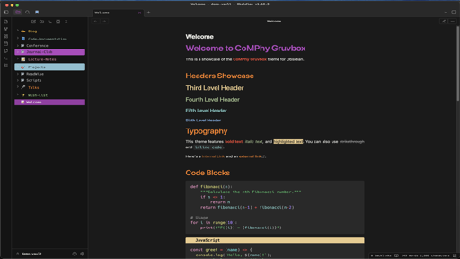

# comphy-obsidian-theme

A research-focused Obsidian theme for academic and research workflows.

This version is a full rewrite with a modular architecture and a consistent visual system anchored to the accent seed `#68236D`.



## What Changed In This Rewrite

- Accent-first design system based on `#68236D` and tonal variants.
- Editorial scientific typography and spacing for long-form reading.
- Single authoritative navigation layer that preserves legacy folder-structure semantics.
- Broad plugin adapters for Dataview, Calendar, Graph, popovers, and common utility plugins.
- Modular source files compiled into one distributable `theme.css`.

See `MIGRATION.md` for deprecated legacy selectors and mapping guidance.

## Features

### Accent and Color System

- Purple accent family anchored to `#68236D`.
- Dark and light mode parity using semantic tokens.
- Controlled gradients and contrast-tuned surfaces.

### Typography

- Hack Nerd Font baseline (with clean fallbacks).
- Clear heading hierarchy (`h1` to `h6`) with improved rhythm.
- Improved readability for code-heavy and research-heavy notes.

### Navigation and Folder Semantics

- Preserves structural groups used in existing vaults:
  - `_...`
  - `0-...`, `1-...`, `2-...`, `3-...`
  - `Projects`, `Z_Archive`, and key named aliases
- Simplified icon language to reduce visual noise.

### Plugin Coverage

- Dataview card layouts (table + list patterns)
- Calendar plugin variable theming
- Graph view color harmonization
- Popovers/embeds and utility plugin alignment

## Installation

### From Community Themes

1. Open Obsidian Settings.
2. Go to **Appearance** -> **Themes**.
3. Click **Manage** and search for `comphy-obsidian-theme`.
4. Click **Install and use**.

### Manual Installation

1. Download `theme.css` and `manifest.json`.
2. Create `.obsidian/themes/comphy-obsidian-theme/` in your vault.
3. Copy `theme.css` and `manifest.json` into that folder.
4. Enable the theme from Obsidian Appearance settings.

## Development

### Source Layout

- `src/theme/tokens.css` - design tokens and Obsidian variable mapping
- `src/theme/foundations.css` - base layout and typography
- `src/theme/components.css` - core components and interaction states
- `src/theme/navigation.css` - preserved folder-structure mapping layer
- `src/theme/plugins.css` - plugin adapters
- `src/theme/accessibility.css` - focus, reduced motion, print behavior

### Build

```bash
bash scripts/build-theme.sh
```

This generates `theme.css` from `src/theme/*.css`.

## Demo Vault

A sanitized `demo-vault/` is included for previewing theme behavior.

```bash
bash install.sh demo-vault
```

When run from this repository, `install.sh` auto-builds `theme.css` from `src/theme/*.css` before copying files into the vault.

`demo-vault/.obsidian/` is not tracked.

## Recommended Font

This theme is optimized for [Hack Nerd Font](https://www.nerdfonts.com/font-downloads).

## Credits

- Built for [CoMPhy Lab](https://comphy-lab.org)

## License

MIT License. See [LICENSE](LICENSE).
